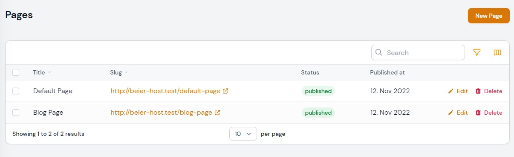
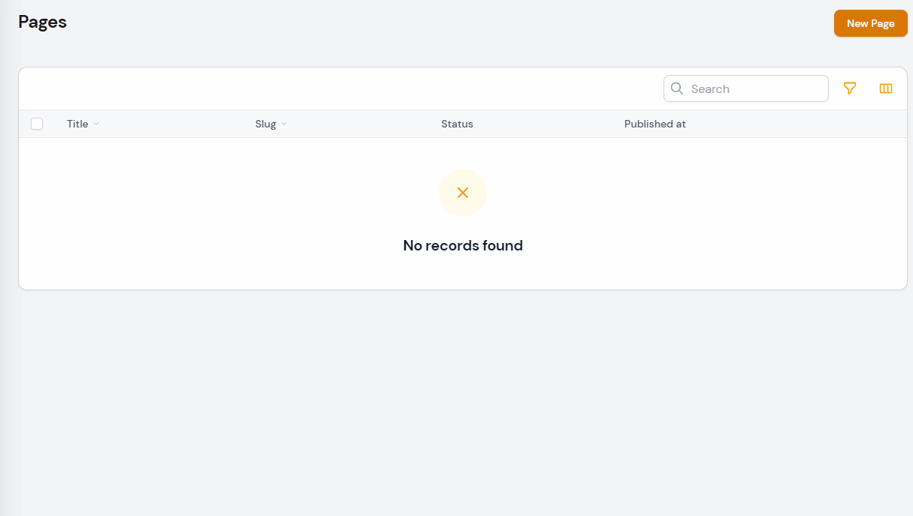
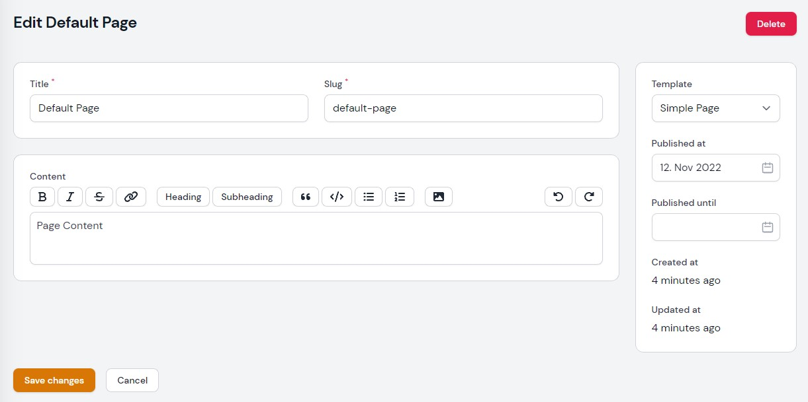

# beier/filament-pages

[](https://packagist.org/packages/beier/filament-pages)
[](https://github.com/beier/filament-pages/actions?query=workflow%3Arun-tests+branch%3Amain)
[](https://packagist.org/packages/beier/filament-pages)


A starting point to create a Page Resource and front routing with filament.
It is the result of packaging our Page CMS functionality.

> This package does not register any routes, as page routing always depends on your project.
> This is meant to be providing you a quickstart in creating a dynamic page module.

## Demo




## Screenshots




## Installation

You can install the package via composer:

```bash
composer require beier/filament-pages
```

You can run the installation command with:

```bash
php artisan filament-pages:install
```

This is the contents of the published config file:

```php
<?php

use Beier\FilamentPages\Filament\FilamentPageTemplates\DefaultTemplate;
use Beier\FilamentPages\Filament\Resources\FilamentPageResource;
use Beier\FilamentPages\Models\FilamentPage;
use Beier\FilamentPages\Renderer\SimplePageRenderer;

return [
    'filament' => [
        /*
        |--------------------------------------------------------------------------
        | Filament: Custom Filament Resource
        |--------------------------------------------------------------------------
        |
        | Use your own extension of the FilamentPageResource
        | below to fully customize every aspect of it.
        |
        */
        'resource' => FilamentPageResource::class,
        /*
        |--------------------------------------------------------------------------
        | Filament: Custom Filament Model
        |--------------------------------------------------------------------------
        |
        | Use your own extension of the FilamentPage Model
        | below to fully customize every aspect of it.
        |
        */
        'model' => FilamentPage::class,
        /*
        |--------------------------------------------------------------------------
        | Filament: Title Attribute
        |--------------------------------------------------------------------------
        |
        | Point to another field or Attribute to change the
        | computed record title provided in filament.
        |
        */
        'recordTitleAttribute' => 'title',
        /*
        |--------------------------------------------------------------------------
        | Filament: Label
        |--------------------------------------------------------------------------
        |
        | If you don't need to support multiple languages you can
        | globally change the model label below. If you do,
        | you should rather change the translation files.
        |
        */
        'modelLabel' => 'Page',
        /*
        |--------------------------------------------------------------------------
        | Filament: Plural Label
        |--------------------------------------------------------------------------
        |
        | If you don't need to support multiple languages you can
        | globally change the plural label below. If you do,
        | you should rather change the translation files.
        |
        */
        'pluralLabel' => 'Pages',
        'navigation' => [
            /*
            |--------------------------------------------------------------------------
            | Filament: Navigation Icon
            |--------------------------------------------------------------------------
            |
            | If you don't need to support multiple languages you can
            | globally change the navigation icon below. If you do,
            | you should rather change the translation files.
            |
            */
            'icon' => 'heroicon-o-document',
            /*
            |--------------------------------------------------------------------------
            | Filament: Navigation Group
            |--------------------------------------------------------------------------
            |
            | If you don't need to support multiple languages you can
            | globally change the navigation group below. If you do,
            | you should rather change the translation files.
            |
            */
            'group' => 'content',
            /*
            |--------------------------------------------------------------------------
            | Filament: Navigation Group
            |--------------------------------------------------------------------------
            |
            | If you don't need to support multiple languages you can
            | globally change the navigation sort below. If you do,
            | you should rather change the translation files.
            |
            */
            'sort' => null,
        ]
    ],
    /*
    |--------------------------------------------------------------------------
    | Templates
    |--------------------------------------------------------------------------
    |
    | Add your own Templates implementing FilamentPageTemplate::class
    | below. They will appear in the Template selection,
    | and persisted to the data column.
    |
    */
    'templates' => [
        DefaultTemplate::class,
    ],

    /*
    |--------------------------------------------------------------------------
    | Renderer
    |--------------------------------------------------------------------------
    |
    | If you want to use the Rendering functionality, you can create your 
    | own Renderer here. Take the available Renderers for reference.
    | See FilamentPageController for recommended usage.
    | 
    | Available Renderers:
    | - SimplePageRenderer: 
    |   Renders everything to the defined layout below.
    | - AtomicDesignPageRenderer: 
    |   More opinionated Renderer to be used with Atomic Design.
    |
    | To use the renderer, Add a Route for the exemplary FilamentPageController:
    | 
    |  Route::get('/{filamentPage}', [FilamentPageController::class, 'show']);
    |
    | To route the homepage, you could add a data.is_homepage 
    | field and query it in a controller.
    | 
    */
    'renderer' => SimplePageRenderer::class,

    /*
    |--------------------------------------------------------------------------
    | Simple Page Renderer: Default Layout
    |--------------------------------------------------------------------------
    |
    | Only applicable to the SimplePageRenderer.
    | 
    */
    'default_layout' => 'layouts.app',
];

```

## Usage

### Within Filament

After running the [Install Command](#installation), you will find a new Page Resource in your Filament Admin.

#### Templates

This package uses the concept of Template-based forms by [Dennis Koch (pxlrbt)](https://github.com/pxlrbt).
You can read more about the general idea in his [Filament Trick](https://filamentphp.com/tricks/template-based-forms).

You will find a basic page template. By creating and selecting your own templates, you are able to fully
customize your pages.

To create your own Templates, implement the `Beier\FilamentPages\Contracts\FilamentPageTemplate`:

```php
<?php

namespace App\Filament\FilamentPageTemplates;

use Beier\FilamentPages\Contracts\FilamentPageTemplate;
use Filament\Forms\Components\Card;
use Filament\Forms\Components\RichEditor;

class MyTemplate implements FilamentPageTemplate
{
    public static function title(): string
    {
        return 'My Template';
    }

    public static function schema(): array
    {
        return [
            Card::make()
                ->schema([
                    RichEditor::make('content')
                ]),
        ];
    }
}
```

Finally, register your template in `config/filament-pages.php`:

```php
<?php

return [
    'templates' => [
        // \Beier\FilamentPages\Filament\FilamentPageTemplates\DefaultTemplate::class,
        \App\Filament\FilamentPageTemplates\MyTemplate::class,
    ],
];
```

Your template will appear in the Template Selection and render your schema accordingly.

#### Customizing the Page Resource

You will find most common configuration options in the config file.

To customize every aspect of the Page Resource, you will need to create your own PageResource class, extending `Beier\FilamentPages\Filament\Resources\FilamentPageResource`:

```php
<?php

namespace App\Filament\Resources;

use Beier\FilamentPages\Filament\Resources\FilamentPageResource;
use Filament\Resources\Form;
use Filament\Resources\Table;

class PageResource extends FilamentPageResource
{
    public static function form(Form $form): Form
    {

        return $form
            ->schema([
                //
            ]);
    }
    
    public static function table(Table $table): Table
    {

        return $table
            ->columns([
                //
            ]);
    }
}
```

Then, register your class within `config/filament-pages.php`

```php
<?php

use App\Filament\Resources\PageResource;

return [
    'filament' => [
        'resource' => PageResource::class,
    ],
]

```


## Testing

```bash
composer test
```

## Changelog

Please see [CHANGELOG](CHANGELOG.md) for more information on what has changed recently.

## Contributing

Please see [CONTRIBUTING](.github/CONTRIBUTING.md) for details.

## Security Vulnerabilities

Please review [our security policy](../../security/policy) on how to report security vulnerabilities.

## Credits

- [Pascale Beier](https://github.com/PascaleBeier)
- [All Contributors](../../contributors)

## License

The MIT License (MIT). Please see [License File](LICENSE.md) for more information.
